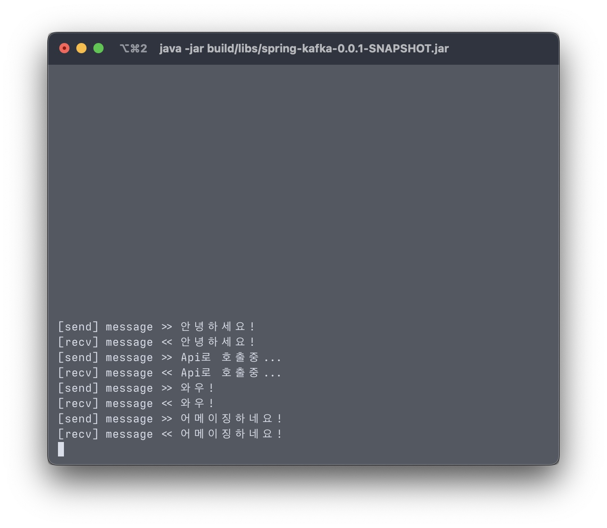

# Spring Kafka

## Kafka

kafka 는 LinkedIn 에서 처음 개발된 <code>분산 메시징 시스템</code> 이다.

kafka 와 같은 Messaging-Queue 를 사용하기 전에는 End-to-End 연결방식의 아키텍쳐를 사용하였기 때문에
서비스가 커지면 커질수록 복잡성이 증가하고, 각기 다른 데이터 파이프라인 구조를 가지고 있었기 때문에 확장에 있어서 비용이 많이 들어갔다.

이러한 문제로 인해 모든 시스템으로 데이터를 전송할 수 있으면서 실시간 처리도 가능한 시스템이 Kafka 이다.

### Producer & Consumer

Producer 와 Consumer 말 그대로 Message 를 생성하고 소비하는 역할을 수행한다. Pub/Sub 에서 Publisher 와 Subscriber 의 역할.

Kafka 의 Consumer<sub>Subscriber</sub> 는 Broker 가 Consumer 에게 Message 를 전달하는 <code>Push</code> 방식이 아닌
Consumer 가 Broker 에게서 Message 를 가져오는 <code>Pull</code> 방식을 채택하고있다.

이러한 <code>Pull</code> 방식의 장점은 Consumer 가 처리가능한 양 만큼 Message 를 가져오기 때문에
Broker 는 Consumer 의 처리량을 신경쓰지 않아도 된다.

### Kafka Broker & Cluster

 - <code>Kafka Broker</code>는 실행된 Kafka Application Server 중 1대를 의미
   - 3대 이상의 Broker로 <code>Cluster</code>를 구축할 수 있다.

Cluster 는 <code>Zookeeper</code>와 연동을 해야한다. 이러한 Zookeeper의 역할은 Broker ID, Controller ID 등.. 메타데이터를 저장하는 역할을 한다.

N개의 Broker 중, 1대는 <code>Controller</code>의 역할을 수행한다. 여기서 Controller 는 각 Broker 에게 Partition 을 할당하거나,
각 Broker의 상태가 정상인지 모니터링 하는 역할을 한다. Zookeeper 는 이러한 Controller 를 수행하는 Broker 는 누구인지 저장하고 있다.

### Record

Producer 가 발행한 Message Data 를 Record 라고 한다.

### Topic & Partition

<code>Topic</code>은 전달되는 Message Stream 의 추상화된 개념이다. (카프카의 데이터를 구분하기 위해 사용된다.)
Producer<sub>Publisher</sub> 가 특정 토픽에 Message 를 발행 시, Consumer<sub>Subscriber</sub> 가 해당 Topic 을 구독하여 소비할 수 있다.

<code>Partition</code>은 Topic을 분할한 단위이며, Topic은 하나 이상의 Partition 을 가지게 된다.

이러한 Partition 은 Kafka 에서 병렬처리를 하는데 핵심이 된다. Record 를 Partition 에 분산 배치 해줌으로써 Consumer 는 이러한 Record 를 병렬로 처리 할 수 있다.
(Data 가 Partition 에 분산 저장될 때는 Round-Robin 방식으로 저장된다.)

Partition 은 여러개의 <code>Log</code> 로 나뉘게 되는데 이러한 Log 에는 고유한 번호인 <code>Offset</code> 이 붙게된다. 배열의 Index 와 비슷한 개념이다.
Offset 0번은 Queue 에 쌓인지 가장 오래된 Data 이며 가장 높은 수를 가진 Offset 은 가장 최근에 쌓인 Data 를 의미한다.

만약 Topic 이 하나의 Partition 을 가진다면 순서가 보장된다. Partition 은 Queue 구조이기 때문이다.
단, Topic 이 두개 이상의 Partition 을 가진다면 완전한 순서가 보장되지 않는다 두개의 Partition 이 Data 를 나누어 가지기 때문에 두개의 순서를 가지게 되는 셈이다.

 * Partition 설정 시 주의점은 Partition 은 한번 늘릴 시 절대로 줄일 수 없다. 따라서 운영중 Partition 을 늘릴때에는 신중하게 고민을 해보아야한다.

### Consumer Group

기존 Message Queue 에서는 Consumer<sub>Subscriber</sub> 가 Message 를 가져가면 Queue 에서 삭제되어 다른 Consumer 가 Message 를 소비할 수 없다.

하지만 Kafka 는 Consumer 각 Message 를 소비해도 Queue 에서 Message 가 **즉시** 사라지지 않는다.
따라서 하나의 Topic 에 여러 <code>Consumer Group</code> 가 붙어 메시지를 가져갈 수 있다.

이러한 Consumer Group 은 각 Group 마다 Partition 에 대한 별도의 Offset 을 관리한다.
또한 Group 내 Consumer 가 Insert/Delete 될 때 마다 Re-balancing 을 하여 Group 내의 Consumer 에게 Partition 을 할당하게 된다.

한 Group 의 Consumer 는 Partition 과 1:1 또는 N:1 (Partition : Consumer) 관계를 맺게된다.
Partition 3개, Consumer 2개로 이루어져 있다면 각 각의 Consumer 는 2:1, 1:1 관계를 맺는다.
만약, Partition 2개, Consumer 3개로 이루어져 있다면 두 Consumer는 1:1 관계를 맺고 나머지 하나는 Idle 상태로 대기하게 된다.
따라서, Partition과 Consumer는 1:1 을 권장하며 Consumer 의 성능에 따라 Partition >= Consumer 를 권장한다고 한다.

### Segment

Kafka Broker 는 파티션에 저장된 메시지를 파일 시스템에 저장한다.이 때 만들어지는 파일이 <code>Segment File</code> 이다.
기본적으로 일정 시간이 지나면 파일을 다시 만들지만 일정 시간 전 1GB 를 넘을 경우에도 새파일을 만든다.

* ref.1 : <https://www.youtube.com/watch?v=VJKZvOASvUA>
  * ref.2 : <https://medium.com/@umanking/카프카에-대해서-이야기-하기전에-먼저-data에-대해서-이야기해보자-d2e3ca2f3c2>
  * ref.3 : <https://jyeonth.tistory.com/30>
  * ref.4 : <https://soft.plusblog.co.kr/3?category=896352>

## Spring Kafka

### Before Start

Spring Kafka 실습 전 먼저 Docker Compose 를 활용하여 Kafka 환경을 구성해보자.

우선 Zookeeper 를 추가해 준다.
``` yaml
zookeeper:
    image: wurstmeister/zookeeper
    ports:
      - "2181:2181"
```

Kafka 는 <code>Kafka Cluster</code>, <code>Zookeeper</code> 가 설치되어 있어야하기 때문에 Docker 간의 연결이 필요하다.
따라서 volumes 에 <code>docker.sock</code> 를 추가해주어야 한다.
``` yaml
kafka:
    #build: .
    image: wurstmeister/kafka
    ports:
      - "9092"
    environment:
      DOCKER_API_VERSION: 1.22
      KAFKA_ADVERTISED_HOST_NAME: PLAINTEXT://127.0.0.1
      KAFKA_ADVERTISED_LISTENERS: PLAINTEXT://127.0.0.1:9092
      KAFKA_CREATE_TOPICS: "learning-topic-1:10:1"
      KAFKA_ZOOKEEPER_CONNECT: zookeeper:2181
    volumes:
      - /var/run/docker.sock:/var/run/docker.sock
```

여기서

``` yaml
KAFKA_CREATE_TOPICS: "learning-topic-1:10:1"
```

설정의 경우 순서대로 topic 이름, partition 갯수, replica 갯수를 의미한다.

#### commands

< Topic 관련 >

kafka-topics.sh 를 통해 cli 에서 topic 에 대한 명령을 실행할 수 있다.

``` sh 
kafka-topics.sh --create --topic learning-topic-1 --bootstrap-server localhost:9092 --replication-factor 1 --partitions 10
```

<code>--create</code> 옵션을 통해 topic 을 생성할 수 있다. 뒤따라 오는 옵션은 옵션명과 동일한 의미의 옵션이며, 
<code>--bootstarap.server</code>의 경우 대상이 될 Kafka cluster 를 지정하는 옵션이다.

위의 Docker 설정으로 Kafka 를 구성했다면 <code>KAFKA_CREATE_TOPICS: "learning-topic-1:10:1"</code> 에서 이미 Topic 이 생성되었다.

``` sh
kafka-topics.sh --list --bootstrap-server localhost:9092
kafka-topics.sh --describe --topic learning-topic-1 --bootstrap-server localhost:9092
```

위 Command 를 통해 각각 topic 의 목록과 상세정보를 조회 할 수 있다.

< Producer & Consumer 관련 >

``` sh
# Producer
kafka-console-producer.sh --topic learning-topic-1 --bootstrap-server localhost:9092

# Consumer
kafka-console-consumer.sh --topic learning-topic-1 --bootstrap-server localhost:9092 --from-beginning
```

<table>
  <tr>
    <td align="center">  </td>
  </tr>
  <tr>
    <td width="50%" align="center"> (왼) Producer / (오른) Consumer  </td>
  </tr>
</table>

### Dependency

* ref : https://docs.spring.io/spring-kafka/docs/current/reference/html/#introduction

Spring Framework 에서 지원하는 <code>Spring for Apache Kafka</code>를 통해 Spring 에서 Kafka 를 쉽게 사용할 수 있다.

``` gradle
implementation 'org.springframework.kafka:spring-kafka'
```

### Configuration

Application.yml 에 다음과 같이 설정함으로써 Spring 과 Kafka 를 연동할 수 있다.

``` yaml
spring:  
    kafka:
        
        consumer:      
            bootstrap-servers: 0.0.0.0:9092      
            group-id: learning-kafka-group-1    
            auto-offset-reset: earliest      
            key-deserializer: org.apache.kafka.common.serialization.StringDeserializer      
            value-deserializer: org.apache.kafka.common.serialization.StringDeserializer    
            
        producer:      
            bootstrap-servers: 0.0.0.0:9092      
            key-serializer: org.apache.kafka.common.serialization.StringSerializer      
            value-serializer: org.apache.kafka.common.serialization.StringSerializer
```

* ref : <https://oingdaddy.tistory.com/308>

<code>auto-offset-reset</code> 설정은 <code>earliest</code> 와 <code>latest</code> 가 있으며 
해당 설정을 통해 각각 가장 오래된 offset 부터, 가장 최근 offset 부터 소비하게된다.

<code>group-id</code> 는 Consumer Group 의 ID를 넣어주면된다.

* ref : <https://blog.voidmainvoid.net/305>

### Consumer

``` java
@Service
public class KafkaSampleConsumerService {

	@KafkaListener(topics = "learning-topic-1", groupId = "learning-kafka-group-1")
	public void consumer(String message) throws IOException {
		System.out.println("message > " + message);
	}

}
```

<code>@KafkaListener</code> annotation 을 붙여주게되면 해당 Method 는 설정된 topic 을 <code>consuming</code> 하게된다.

<table>
  <tr>
    <td align="center">  </td>
  </tr>
  <tr>
    <td width="50%" align="center"> (왼) Spring / (오른) cli - Producer </td>
  </tr>
</table>

* ref : <https://oingdaddy.tistory.com/308>

### Producer

``` java
@Service
public class KafkaSampleProducerService {

	@Autowired
	private KafkaTemplate<String, String> kafkaTemplate;

	public KafkaSampleProducerService(KafkaTemplate<String, String> kafkaTemplate) {
		this.kafkaTemplate = kafkaTemplate;
	}

	public void sendMessage(String message) {
		System.out.println("[send] message >> " + message);
		kafkaTemplate.send("learning-topic-1", message);
	}

}
```

<code>KafakTemplate</code> 의 <code>send()</code> Method 를 통해 손쉽게 원하는 Topic 에 Data 를 보낼 수 있다.

``` java 
@RestControllerpublic
@required 
class KafkaSampleProducerController {        
        
    private final KafkaSampleProducerService kafkaSampleProducerService;     
    
    @PostMapping(value = "/sendMessage")    
    public void sendMessage(String message) {    	
        kafkaSampleProducerService.sendMessage(message);    
    }
}
```

<table>
    <tr>
        <td width="50%" align="left">
            <pre>
[POST] http://localhost/api/v1/sample
Content-type: application/x-www-form-urlencoded
{
    "message" : "여기 메시지 입력"
}
            </pre>
        </td>
        <td width="50%" align="center">  </td>
    </tr>
    <tr>
        <td align="center" colspan=2> (왼) Api / (오른) Log on Spring </td>
    </tr>
</table>

* ref : <https://oingdaddy.tistory.com/308>

### Topic

Spring 에서 <code>NewTopic</code> 를 Bean 으로 생성함으로써 kafka 에 새로운 Topic 을 생성할 수 있다. 

``` java
@Configuration
public class kafkaSampleConfig {

    @Bean
    public NewTopic sampleTopic () {
        return TopicBuilder
            .name("learning-kafka-group-on-spring")
            .partitions(10)
            .replicas(1)
            .build();
    }

} 
```

``` sh
# in docker container
> kafka-topics.sh --list --bootstrap-server localhost:9092

__consumer_offsets
learning-kafka-group-on-spring
learning-topic-1
```

### Ways to send message

#### 1. Fire-and-forget
send() Method 로 메시지를 전송만 하고, 성공 또는 실패 여부에 따른 후처리를 진행하지 않는다. 
그렇기 때문에 Message 가 유실될 가능성이 있다.

#### 2. Sync send
Message 를 동기적으로 처리, Message 가 전송되면 Future 객체가 반환된다. 
Broker 로 부터 처리결과가 반환되기 때문에 성공여부를 알 수 있다.

<code>RecordMetadata</code>를 Record 의 여러 정보를 받을 수 있다.

``` java 
producer.send(record).get();
```

다음과 같이 <code>get()</code> Method 가 호출될 시 작업이 완료될 때까지 대기하게된다.

#### 3. Async send
Broker 의 응답을 기달이지 않고 비동기로 처리한다. 
<code>Callback Method</code> 를 활용하여 후처리를 진행한다.

``` java
private class ProducerCallback implements Callback {

	@Override
	public void onCompletion(RecordMetadata recordMetadata, Exception e) {
		if (e != null) {
			e.printStackTrace();	
		}
	}
	
}

producer.send(record, new ProducerCallback());
```

다음과 같이 <code>send()</code> Method의 2번째 인자에 Callback 객체를 생성하게되면, 
Callback 객체의 Method 를 호출하게되고, 
이를 통해 후처리를 진행하게 된다.

*ref : <https://rebeccajo.tistory.com/40>

> 위에서는 KafkaListener를 통해 인자를 받을 때, 단순 Object 를 통해 데이터를 받았다.   
> <code>ConsumerRecord</code>, <code>ProducerRecord</code>와 같은 객체로 데이터를 받을 경우, 
> 단순 Message 외 partition, offset 등.. Record 의 여러 정보를 받아올 수 있다.
> 
> ```java
> ConsumerRecord(topic = learning-topic-1, partition = 0, leaderEpoch = 0, offset = 0, CreateTime = 1659184389056, serialized key size = -1, serialized value size = 22, headers = RecordHeaders(headers = [], isReadOnly = false), key = null, value = 테스트!)
> ```

### Serialization & Deserialization
Spring 에서 Kafka 에 Data 를 주고받기 위해 Serialization & Deserialization 을 진행하게 된다. 
만약 DTO 를 Kafka 에 보내게 되면 JSON, ByteBuffer 등.. 의 형태로 Serialization 을 해주어야한다.

```java
public class KafkaByteSerializer implements Serializer {

	@Override
	public void configure (Map configs, boolean isKey) {
		Serializer.super.configure(configs, isKey);
	}

	@Override
	public byte[] serialize (String topic, Object data) {
		try(
				ByteArrayOutputStream byteStream = new ByteArrayOutputStream();
				ObjectOutputStream objectStream = new ObjectOutputStream(byteStream);
		) {
			objectStream.writeObject(data);
			objectStream.flush();
			objectStream.close();
			return byteStream.toByteArray();

		} catch (Exception e) {
			throw new SerializationException("Error when serializing to byte[] for kafka message");
		}
	}

	@Override
	public byte[] serialize (String topic, Headers headers, Object data) {
		return Serializer.super.serialize(topic, headers, data);
	}

	@Override
	public void close () {
		Serializer.super.close();
	}

}
```

```java
public class KafkaByteDeserializer<T> implements Deserializer<T> {

	@Override
	public void configure (Map<String, ?> configs, boolean isKey) {
		Deserializer.super.configure(configs, isKey);
	}

	@Override
	public T deserialize (String topic, byte[] data) {
		try(
				ByteArrayInputStream byteStream = new ByteArrayInputStream(data);
				ObjectInputStream objectStream = new ObjectInputStream(byteStream);
		) {
			final T deserialized = (T) objectStream.readObject();
			objectStream.close();
			return deserialized;

		} catch (Exception e) {
			throw new SerializationException("Error when serializing to byte[] for kafka message");
		}
	}

	@Override
	public T deserialize (String topic, Headers headers, byte[] data) {
		return Deserializer.super.deserialize(topic, headers, data);
	}

	@Override
	public void close () {
		Deserializer.super.close();
	}
}
```

위와 같이 <code>Serializer</code>, <code>Deserializer</code> Interface 를 상속받아 구현함으로써 Serialzer, Deserializer 를 Custom 할 수 있다.

이를 <code>value-serializer</code>, <code>value-deserializer</code> 에 설정함으로써 custom 된 serializer, deserializer 를 활용할 수 있다.